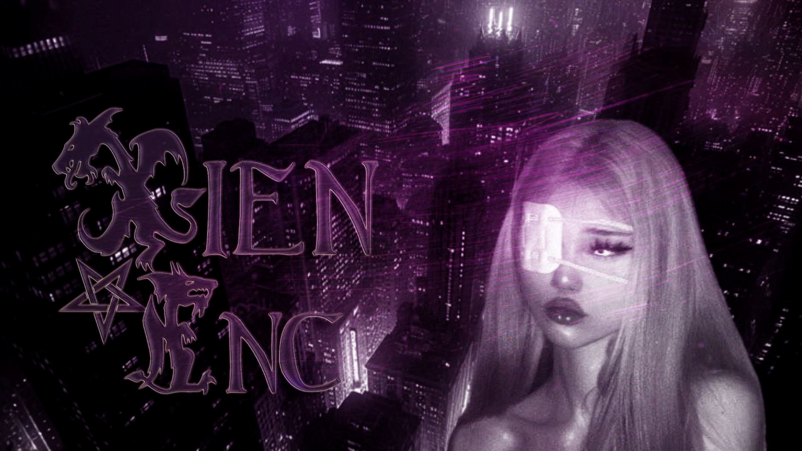

# **XiEn INC**

### *Fullstack Developer, Cybersecurity Researcher & Team Weak Member*

  

---

## 🇹🇷 Türkçe

### **Hakkımda**

> *Fullstack web geliştirme, sistem mimarisi, tehdit istihbaratı ve dijital güvenlik konularına derin bir tutkuyla bağlıyım.*

<picture>
  <source media="(prefers-color-scheme: dark)" srcset="assets/logo-dark.png">
  <source media="(prefers-color-scheme: light)" srcset="assets/logo-light.png">
  
</picture>

* **Kurucu Üye:** **Team Weak** — Instagram'da kötü niyetli, sahte ve uygunsuz içerikleri kaldırmaya yönelik gönüllü bir girişim. Kötüye kullanım bildirimi ve içerik kaldırma süreçleri için ücretli danışmanlık hizmeti de sunulmaktadır.
* **Odak Alanları:** Web Sistem Mimarisi, Web Uygulama Güvenliği, DNS Analitiği ve Tehdit Avcılığı.
* **Temel Yetkinlikler:** Fullstack Geliştirme, API Gateway Mimarisi, Veritabanı Optimizasyonu ve Dijital Varlık Koruması.
* **Çalışma Ortamı:** Windows 11 üzerinde WSL2 içinde Arch Linux ve Ubuntu birlikte çalışıyor; JavaScript/PHP Ekosistemleri.

### **Teknik Araç Seti**

* **Ana Dil:** `PHP`
* **Diğer Diller ve Web:** `JavaScript` | `TypeScript` | `Python` | `PowerShell` | `HTML` | `CSS` | `SQL`
* **Veritabanları:** `MariaDB` | `MySQL` | `SQLite`
* **Altyapı & Analiz:** `WSL (Arch / Ubuntu)` | `OSINT & Tehdit İstihbaratı Araçları` | `REST API'ler`

### **Bağlantı & İletişim**

* **GitHub:** [Tıkla](https://github.com/xieninc)
* **Telegram:** [Tıkla](https://t.me/xieninc)
* **Xien Yönlendirme Kanalı:** [Tıkla](https://t.me/arzulanirim)
* **Team Weak Kanalı:** [Tıkla](https://t.me/+ke_-GcKcoFw0MmZh)

---

## 🇬🇧 English

### **About Me**

> *Driven by a deep passion for fullstack web development, system architecture, threat intelligence, and digital safety.*

<picture>
  <source media="(prefers-color-scheme: dark)" srcset="assets/logo-dark.png">
  <source media="(prefers-color-scheme: light)" srcset="assets/logo-light.png">
  
</picture>

* **Founding Member:** **Team Weak** — a voluntary initiative removing malicious, fraudulent, and inappropriate content on Instagram. Paid consulting is also available for abuse reporting and content-takedown requests.
* **Focus Areas:** Web System Architecture, Web Application Security, DNS Analytics, and Threat Hunting.
* **Core Competencies:** Fullstack Development, API Gateway Architecture, Database Optimization, and Digital Asset Protection.
* **Workflow Environment:** Windows 11 running both Arch Linux and Ubuntu side by side via WSL2; JavaScript/PHP Ecosystems.

### **Technical Toolkit**

* **Core Language:** `PHP`
* **Other Languages & Web:** `JavaScript` | `TypeScript` | `Python` | `PowerShell` | `HTML` | `CSS` | `SQL`
* **Databases & Storage:** `MariaDB` | `MySQL` | `SQLite`
* **Infrastructure & Analysis:** `WSL (Arch / Ubuntu)` | `OSINT & Threat Intel Tools` | `REST APIs`

### **Connect & Contact**

* **GitHub:** [Click](https://github.com/xieninc)
* **Telegram:** [Click](https://t.me/xieninc)
* **XiEn Routing Channel:** [Click](https://t.me/arzulanirim)
* **Team Weak Channel:** [Click](https://t.me/+ke_-GcKcoFw0MmZh)

---

*"Continuously refining code, securing networks, and optimizing high-throughput workflows."*

**By. XiEn INC & XiEn Özyurt**
